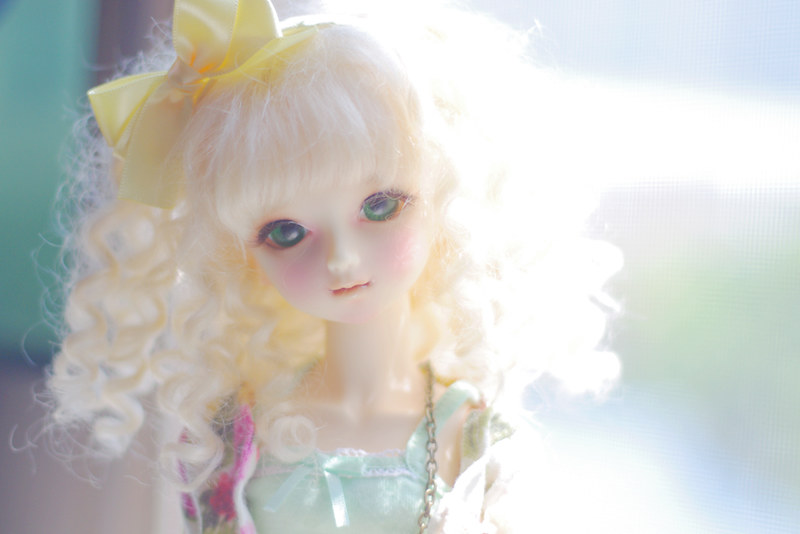
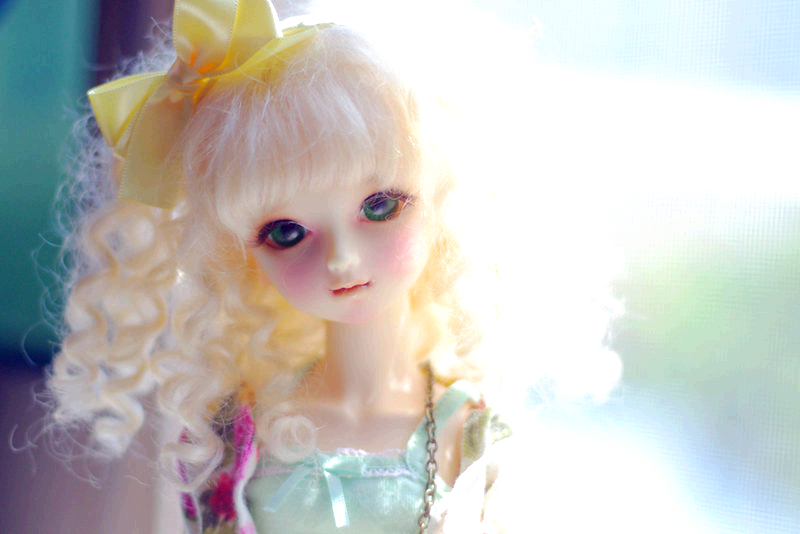
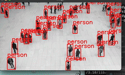
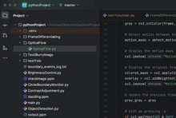

# Image Processing and Object Detection Algorithms

## Overview
This project is a collection of algorithms and techniques for video, frame(image) processing and object detection, including brightness and contrast adjustment, image quality analysis, and human movement detection using YOLO combined with other algorithm to improve the limitation of YOLO.
## 20.11.2024
### Key Functionalities
####  1. **Brightness Adjustment** ✔
- Adjusts the brightness of an image using pure mathematical operations (no external libraries required).

#### 2. **Contrast Adjustment**  ✔
- Modifies the contrast of an image using custom mathematical algorithms, ensuring lightweight implementation without relying on libraries.

#### 3. **Image Quality Analysis**  ✔
- Determines the brightness status of an image (e.g., well-lit, underexposed).  
- Detects if an image is blurry or sharp using simple yet effective metrics.  
- Provides actionable insights into image quality.

#### 4. **Restricted Area Detection** .✔  -will be improved soon
- A basic algorithm to check for objects entering a restricted area
- Designed for controlled environments with specific conditions:
  - **Background:** White floor or predefined static background.
  - **Object Appearance:** Objects wearing specific colors (e.g., black clothing).  
- Limited to predefined environments; Highly environment-dependent.  
- Needs further improvement to adapt to dynamic environments with varying colors or backgrounds.

## 27.11.2024
#### 5. **YOLO-based Object Detection**  ✔
- Utilizes YOLOv8 for human detection.  
- Efficiently identifies objects that fall within the pretrained classes of YOLO.

#### 6. **Movement Detection for Non-YOLO Classes** ✔-on the way 
- Detects motion in the scene even when objects are not part of YOLO’s predefined classes.  
- Uses a hybrid approach combining YOLO detection with optical flow:  
  - **Green Boxes:** Objects detected by YOLO.  
  - **Red Boxes:** Movement detected via optical flow that is not associated with YOLO-detected objects.

---

## Implementation Details

### Brightness and Contrast Adjustment
- Brightness and contrast adjustment algorithms are designed with pure mathematics. You can use your own value to adjust brightness, contrast of image
- These algorithms avoid the need for external libraries, ensuring lightweight and portable code.
#### Original Image vs Adjusted Image after using Algo.

  
  

### Image Quality Analysis ✔
- **Brightness Check:** Compares image pixel intensity to predefined thresholds.  
- **Blurriness Detection:** Analyzes the image's edge sharpness using variance in pixel gradients.  
- **Sharpness Check:** Provides a confidence score for clarity, check if image is sharpness or blury
  - Laplacian Operator: The method uses the Laplacian edge detection technique to highlight areas of high contrast in the image, which helps determine sharpness.
  - Variance Calculation: The variance of the Laplacian result is calculated to evaluate the overall sharpness of the image.
  - Blurriness Check: If the variance is below a threshold (default: 100), the image is classified as blurry; if it exceeds the threshold, the image is considered sharp.

### Restricted Area Object Detection
- Relies on background subtraction and color segmentation.  
- Sensitive to environmental changes; improvements required for diverse use cases.

### Human Detection with YOLOv8
- Integrated YOLOv8 for human and object detection based on pre-trained models.
- Functions optimally within the specified classes in YOLO’s training data.
#### Video Example:
- Original

-  Output using Algo utilize YOLOv8 
  - (slow because i use cpu to run, with better cpu, or use gpu -> process time/frame can up to 18ms)
  

## Movement Detection:
### Movement Detection with Background subtraction(current in ./testYolo/main)
- YOLOv8 detects objects and draws bounding boxes for recognized objects.
- Background subtraction detects any motion.
- Motion is checked for overlap with YOLO bounding boxes.
- Motion not detected by YOLO is marked with a green bounding box, while YOLO objects remain in red.
- Output using Algo utilize YOLOv8 
  - (slow because i use cpu to run, with better cpu, or use gpu -> process time/frame can up to 18ms)
  
  

### Movement Detection with Optical Flow
- Enhances YOLO detection by identifying motion that YOLO cannot detect (e.g., unknown objects or subtle movements).  
- Combines optical flow with YOLO to avoid redundant detections:  
  - Motion overlapping with YOLO-detected objects(green bounding box) is ignored.  
  - Unique movements are highlighted with red bounding boxes.
  - the higher magnitude threshold parameter we set, the more algo. will ignore the smaller motion mevement.
- Output Test using Algo of ONLY Optical Flow to detect motion- magnitude=2.0(threadhold used to create motion mask)
  - (slow because i use cpu to run, with better cpu, or use gpu -> process time/frame can up to 18ms)

- Result Test combining both Yolo and  Optical Flow(magnitude:3.0) to detect 
  - (slow because i use cpu to run, with better cpu, or use gpu -> process time/frame can up to 18ms)
  - only yolo can not detect the ball, which was played by 2 people

  
---

## Known Limitations and Future Improvements

### Brightness and Contrast Adjustment
- Algorithm works as expected,can use user-defined adjustment levels for more control. Goal: can update to the version where picure, video can auto adapt brightness

### Optical Flow Limitations
- Susceptible to noise from shadows or minor lighting changes.  
- Further refinements required to enhance reliability in complex scenarios.

### Human Detection with YOLO
- Restricted to YOLO’s pre-trained class list.  
- Future plans include training custom YOLO models for obj which will present most of the time in cobot working space but not defined in yolo training data

---

## Testing and Reliability- FUTURE WORK
Test cases for:
#### Important
1. decide the final algo. to use with YOLO -> improve and write clean code 
2. **multiple edge case scenario**:
   - 2 people carry 1 tag
   - people wearing tag/stamp of robot 
   - people,cobot wear no stamp
   - ...
#### Optional
1. **Shadow Mitigation in Optical Flow**:  
   - Apply shadow detection/removal algorithms to improve motion detection reliability.
2. **Brightness Adjustment**:
   - Input images with varying brightness levels.
   - Verify output brightness against expected values.
3. **Contrast Adjustment**:
   - Validate output contrast with known mathematical transformations.
4. **Blurriness and Sharpness Detection**:
   - Use a dataset with predefined sharpness/blurriness labels.
   - Evaluate detection reliability using precision and recall metrics.
   
5**Shadow Mitigation in Optical Flow**:  
   - Apply shadow detection/removal algorithms to improve motion detection reliability.

6**Custom Training for YOLO**:  
   - Extend YOLO capabilities to include additional object classes beyond its pre-trained specifications.

---
